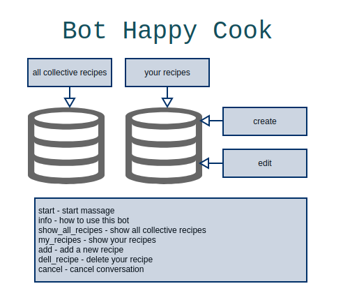

# bot_happy_cook

This is a simple telegram bot that can save your messages and store that in DB. Nested handlerConversation structure provided.

Try it @cook_happy_bot on your telegram=)

# requirements 

```
pip install python-telegram-bot==20.0a4
```

# schema


